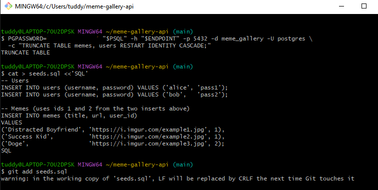

# Meme Gallery API

A tiny Express API (ES Modules) that demonstrates **GET /memes**, **GET /memes/:id**, and **POST /memes** with small, readable middleware and validation. Perfect for practicing routes, async handlers, and basic HTTP testing with curl/Postman.

---

## Features

- Node.js + Express with **ES Modules** (`"type": "module"`)
- In-memory data store (resets on restart)
- Routes:
  - `GET /` – health check
  - `GET /memes` – list all memes
  - `GET /memes/:id` – fetch a single meme by id
  - `POST /memes` – create a meme (async-friendly)
- Middleware:
  - JSON body parsing
  - Malformed JSON handling (returns 400)
  - Simple request logger
  - 404 fallback + generic error handler
- Stricter input validation (non-empty strings + URL parsing)

---

## Requirements

- Node.js (LTS recommended)
- npm

---

## Setup

bash
npm install

---

## Screenshots

### GET /memes (list all)

### GET /memes/:id (generic)

### GET /memes/:id (success: id=1)

### GET /memes/:id (404: id=9999)

### POST /memes (create)

### /error-test (500)

### Logger output (console)

---

## Update & Delete — Screenshots

### PUT /memes/:id (update)

### GET /memes/:id after delete (should be 404)

### GET /memes (verify it’s gone)

## Database (AWS RDS PostgreSQL)  10-4-2025 
Week2 Day1

**Tables created**

**CRUD on RDS (insert → select → update → select → delete → select)**

**RDS Connection Info**

### SQL Queries on AWS RDS
Week2 Day2

Below are the required screenshots from this task:

**Insert seed data (psql)**
_Shows the three INSERTs running successfully._

**Filter memes by user (user_id = 1)**
_Shows the results of `SELECT * FROM memes WHERE user_id = 1;`_

**Join users → memes**
_Shows usernames with their meme titles/urls using an inner JOIN._

## User Memes Endpoint (Prisma)

These confirm the `/users/:id/memes` route.

### ✅ Success: `GET /users/1/memes`
Returns all memes created by user **1**.

### ❌ Not Found: `GET /users/999/memes`
Returns `404` when the user does not exist.

