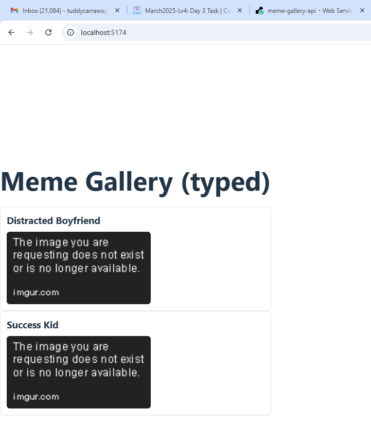

# Meme Gallery API "Frontend"

## MemeList (TypeScript Generics)

- `src/types/meme.ts` defines the `Meme` interface.
- `src/components/MemeList.tsx` is a generic list: `MemeList<T extends Meme>`.
- `src/App.tsx` renders memes (mock or real API via `src/lib/api.ts`).

### Dev
```bash
npm install
npm run dev
```

## Frontend — Local Meme Site (Typed MemeList)

**Localhost Preview**

