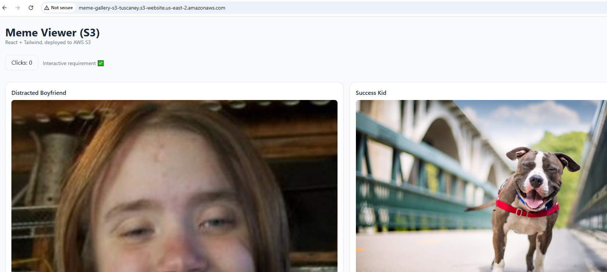
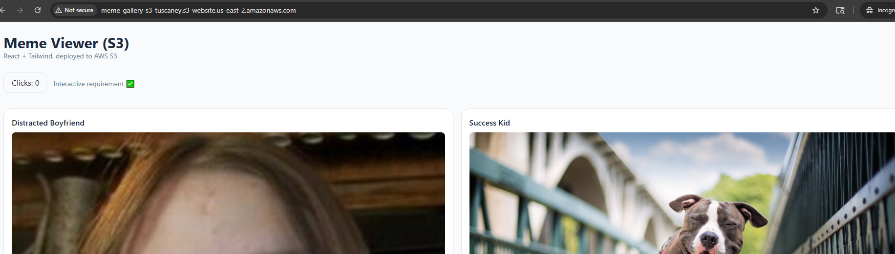

# 🖼️ Meme Viewer (React + Tailwind) — AWS S3 Deployment

This project was built with **React** and **TailwindCSS**, then deployed as a static website to an **AWS S3 bucket** for public access.

### 🌐 Live URL
**[View the live app here](http://meme-gallery-s3-tuscaney.s3-website.us-east-2.amazonaws.com)**  
Deployed to region: **us-east-2**

---
## Screenshots

